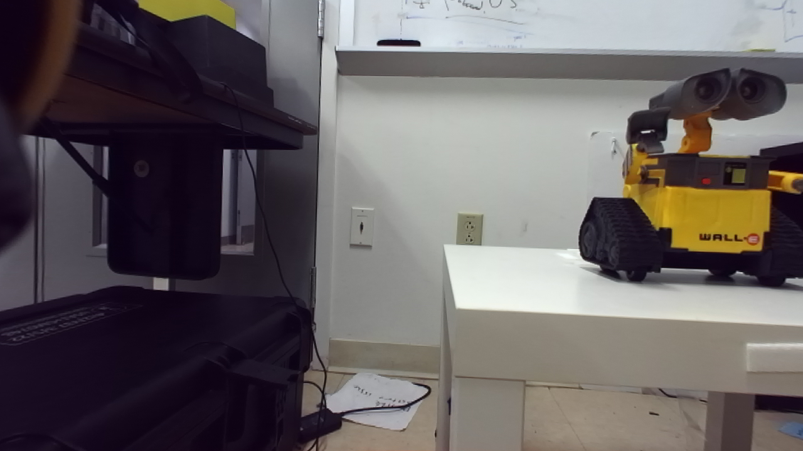

# Adapting NeRF for Low-Latency Reconstruction in VR Teleoperation

   

  

In order to optimize virtual reality (VR) for teleoperation, 360-degree scene reconstruction is necessary for complex navigation and depth estimation. Previous point-cloud based methods create latency between user and robot head movements that cause confusion and nausea. NeRF methods provide SotA novel-view synthesis, but also suffer due to high latency. We develop a novel pipeline based on an Efficient-NeRF(ENeRF)-backbone to generate free-viewpoint scenes. We adapt a PyTorch implementation of ENeRF, and achieve a 60 degree field-of-view. Future work involves stitching together separate views for an instantaneous, 360-degree reconstruction, as well as adapting the network for Unity to allow for real-world usage through the Spot interface.
                                                                                                                                  
**Source views and novel-view results:**

    

       

    

    

    
