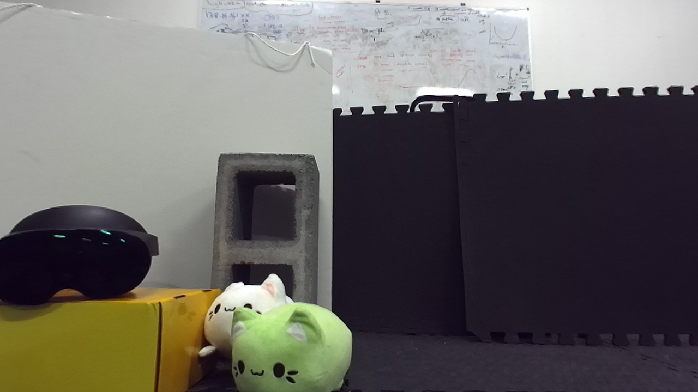

# Instantaneous 3D Scene Reconstruction using ENeRF

   

  

In order to optimize the experience of teleoperation, 360 degrees scene reconstruction in virtual reality is ideal for users to see the robots’ surroundings and perform tasks that involve complex navigation and depth estimations. Previous work has mostly focused on using point-cloud reconstruction methods, yet these create latency between user and robot head movements that cause confusion and nausea. In order to resolve the issue, we are working to develop a teleoperation system that uses ENeRF to perform novel view synthesis in order to generate free-viewpoint scenes. Given multiview images from a stereo pair of ZED Mini cameras, the network uses the plane sweeping algorithm that infers depth information and constructs a coarse geometry of the scene; the geometry allows the network to sample a few points near the scene surface, thereby significantly improving the speed of rendering novel views through radiance field networks. We adapted ENeRF in python and we have achieved 60 degrees field of view, and we hypothesize the full implementation of the network in the unity pipeline will allow us to achieve instantaneous 360 degrees scene reconstruction.                                                                                                                                   

**Source views and novel-view results:**

    

       

    

    

    
